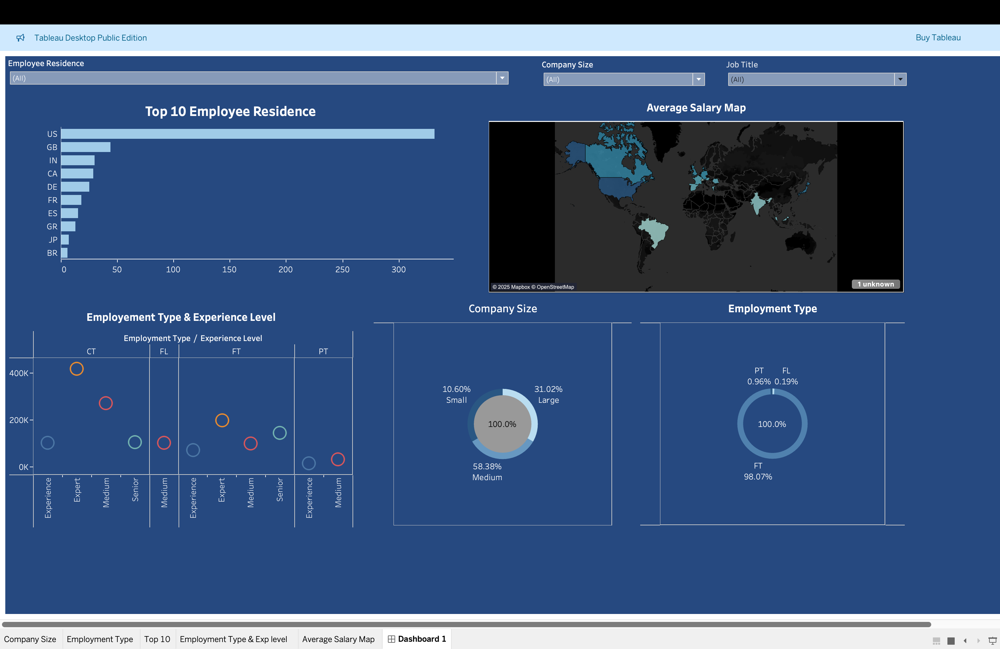

# 📊 Tableau Dashboard – Global Data Science Salary Analysis

## 🧭 Executive Summary

This project explores global data science salary trends using Tableau. The dashboard provides insights into how salary varies by location, job title, company size, employment type, and experience level. The aim is to support HR, recruiting, and compensation teams in understanding the evolving market landscape in the data science field.

---

## 💼 Business Problem

With the growing global demand for data professionals, understanding salary expectations and how they differ by country, role, and experience level is critical for:
- **Attracting top talent**
- **Maintaining competitive compensation**
- **Identifying regional salary gaps**

Companies and job seekers alike need clear visual insights to make informed decisions in an increasingly remote and competitive job market.

---

## 🔍 Methodology

- **Data Source**: [ds_salaries.csv](ds_salaries.csv) – A public dataset containing anonymized salaries of data professionals worldwide.
- **Data Preparation**:
  - Cleaned and transformed using Tableau Prep and in-built Tableau features.
  - Removed null values, standardized job titles, and categorized experience levels.
- **Dashboard Development**:
  - Created multiple interactive charts and filters to explore:
    - Top countries by employee count
    - Salary by company size and employment type
    - Global salary map by average earnings
    - Bubble plots for experience vs. employment type

---

## 🛠️ Skills Demonstrated

- Tableau Desktop (Public Edition)
- Data Cleaning & Transformation
- Data Visualization & Dashboard Design
- Geographic Mapping (Mapbox)
- Filters, Parameters & Drill-downs
- Analytical Storytelling

---

## 🖼️ Dashboard Preview

*Above: A snapshot of the interactive Tableau dashboard highlighting employment type, geography, and salary distribution among data professionals.*

---

## 📈 Results & Business Recommendations

- **United States, Great Britain, and India** have the highest number of data professionals in the dataset.
- Most professionals are employed full-time, with a strong presence in medium to large companies.
- **Salaries correlate strongly with experience level**, particularly for contract roles.
- **Cellular employment types and larger companies offer the most competitive salaries.**

### ✅ Recommendations:
- Employers should benchmark salaries against global and regional data.
- Target experienced professionals in underrepresented countries with competitive offers.
- Re-evaluate compensation strategies for part-time and freelance roles to stay competitive.

---

## 🔮 Next Steps

- Publish the dashboard to Tableau Public for live interaction
- Incorporate additional filters for remote vs on-site work
- Combine with LinkedIn job posting data for dynamic hiring trend analysis
- Expand to include non-data science roles for broader benchmarking

---

📫 **Connect with me**  
[LinkedIn](https://www.linkedin.com/in/yusufolayinka-dataanalyst)  
📧 yusufolayinka1014@gmail.com  
